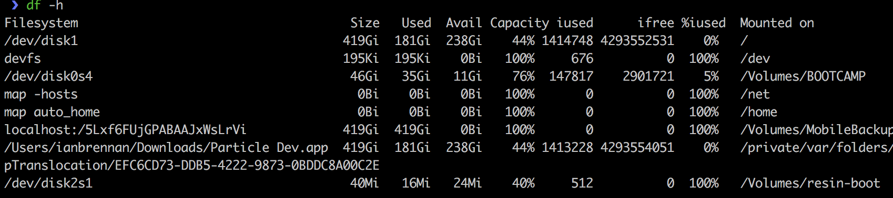

| Table Of Contents                   |
| ------------------------------------|
| [Introduction](../README.md)           |
| [Part 0: Prework](prework.md)       |
| Part 1: Pi and Web App              |
| [Part 2: Motion Detection](part2.md)|

# Part 1: Pi and Web App
## Introduction

In Part 1 of this tutorial, you are going to set up your Pi and get a web application running locally.
By the end of Part 1, you will have the web application communicating with the Pi so that you can click a button on the web app to take a picture with the Pi's camera.

**Important: Make sure you complete the [prework](prework.md) before diving in to Part 1.**

## Part 1 Steps
- Fork and clone this repo to your own machine
- Set up a resin.io application
- Get the application running locally
- Configure your Pi with a resinOS image
- Get the application talking to the Pi!

Since this tutorial is focused on working with a Pi, we've written the code for the web application for you. That way you don't have to fixate on debugging code when you want to learn about a Pi. If you want more of a challenge, you are welcome to modify or extend the existing code in any way you'd like.

### 1. Fork, clone
[Detailed steps here if you need them!](https://help.github.com/articles/fork-a-repo/)

1. Fork the repo to your own account.
2. Clone: `git@github.com:your-username/PiMotions.git`
3. Navigate into the `static` directory: `cd PiMotions/app/static`
4. Rename the `.env.example` file to `.env` by running `mv .env.example .env` in your terminal.

### 2. Set up and configure your resin.io application

1. We're going to need the resin-cli for steps later on, let's get that downloaded now by copying this command into your terminal:

```
npm install --global --production resin-cli
```
let that run while we move on through the next steps, we won't need it right away

2.Sign in to your resin.io account. If you don't have one, complete the [prework](prework.md) and then come back.

3. You'll see a prompt to create a new application.
    1. Set Device Type to "Raspberry Pi (v1 or Zero)"
    1. Give your application a name!
    1. Click "Create New Application"

4. Click "Add device" to configure a resinOS image specifically for your application. Choose the recommend resinOS version, then toggle on "Development" under "Select Edition" and "Wifi + Ethernet" under "Network Connection".
5. Click Advanced, then select the checkbox "Download configuration file only".
6. Click the Download configuration file

While the resinOS image is downloading, do the following:

5. From your resin.io dashboard, set device configuration variables by clicking on "Fleet Configuration". Add the following two device config variables:
- NAME: `RESIN_HOST_CONFIG_gpu_mem` VALUE: `128`
- NAME: `RESIN_HOST_CONFIG_start_x` VALUE: `1`

These variables make sure that the camera works on the Pi.

6. Add a resin.io remote repo by copying the **git remote add** command in the top right of your dashboard, and running it in the terminal.

While you're waiting for the resinOS image download to finish, you can move on to the next step, which is to get the app running locally.

### 3. Get the app running locally

1. Make sure you are in the `app/static` directory.
2. Make sure Docker is running
3. Run `npm run docker-build`

This will build a Docker image based on our Dockerfile and start our containers. You can follow the process by watching your terminal output.
Once it finishes, your app will be running, so you can navigate to `localhost:80` in your browser to check it out.

3. Navigate to `localhost:80` in your browser. Click on "Webcam" under "Image Source" and then click "Take a Picture".

Note: We don't need to build the Docker image every time we want to start our app. If you want to start the app without rebuilding the image, you can run `npm run start`, which runs `docker-compose up` for us.

`npm run docker-build` may take a few minutes. If your resinOS image has downloaded (from step 2), while you are waiting on the app to build, you can move on to the next step.

### 4. Make a bootable SD card

We have already flashed a base resin OS image onto your SD cards but we will need to do some configuration to get our devices online and on our resin.io accounts.

1. Insert your microSD card  or microSD card adapter with your microSD card inside into your card reader, You should see your computer recognize it as "resin-boot"
2. we want to find the location of our sd card, lets open a terminal window and type:

```
df -h
```
this will return a list like this:

you're looking for /Volumes/resin-boot on the right hand side, when you see that look at the left hand side and you should see a path like /dev/disk2s1, the real path is going to be everything but the trailing s1, jot that path down it should be something like dev/disk2 or dev/disk3

3. You'll also need the path of your configuration file you downloaded earlier for the next step, this should be wherever you store your downloads, jot that down as well.

4. Finally, to sync your sd card with your resin account enter the following into your terminal after adding your path to the sd card and path to your configuration file you jotted down previously

```
sudo resin config inject <path-to-your-config-file-here> --type raspberry-pi --drive <path-to-your-sd-card-here>
```

this should looks something like:

```
sudo resin config inject ~/Downloads/myapp.config.json --type raspberry-pi --drive /dev/disk2
```

5. when you see done here, eject your sd card safely

### 5. Set up your Pi

1. Insert the SD card into your Pi.
2. Plug your Pi into your computer or a power source using a micro USB cable. (We need power!)
3. It make take a few minutes, but your Pi should appear on your [resin.io dashboard](https://dashboard.resin.io/apps).
4. If it doesn't show up and your seeing the led blink 4 times repeatedly, there's something wrong with your wifi configuration, please reach out to one of the workshop leaders and we will resolve the issue with you.

Once your Pi appears in your dashboard you are good to proceed!

### 6. Deploy code to your Pi

1. Navigate to the root of your project (the `PiMotions/` directory). If you're in the `app/static` directory, run `cd ..; cd ..` to get to `PiMotions/`.

2. Run `git push resin master`

This is going to deploy the code in the `server/` directory to our Pi.
If you're curious, you can look at the `Dockerfile.template` file to see the commands that are run.

Note: this may ask you to add this host to your list of allowed hosts. Type 'yes'.

When you see a unicorn appear in your terminal, your push was successful!

Visit your device's Resin page to monitor download progress. This will take ~15 minutes over wifi. While this takes place, continue with setup below!

### 7. Get the web app and the Pi talking to each other

We have an web app running locally that can take a picture using our computer's webcam.
The next step is to get the web app and the Pi talking to each other, so that we can use the Pi's camera to take a picture.

Right now, the "R Pi" button under "Image Source" doesn't do anything. We're about to fix that.

1. Enable a public url for your device. Go into "Actions" on your resin.io device dashboard and click "Enable All Public Device URLs".
Copy the public url and paste it into `app/static/.env` as the value for `RASPI_URL`.

```
RASPI_URL=<your public url here>
```
2. Navigate to `app/static` directory by running `cd app/static` in your terminal.

3. Run `npm run docker-down`, and then run `npm run docker-build`.

4. Check your device's Resin page -- if the download is complete, proceed!

5. Navigate to `localhost:80` in your browser. Click on "R Pi" under "Image Source", and then click "Take Picture".

:tada::tada::tada:

Your web app is now set up to take pictures using your computer's webcam **and** using your Pi.

**In the [Part 2](part2.md), we'll write code to detect motion using the picamera.**
