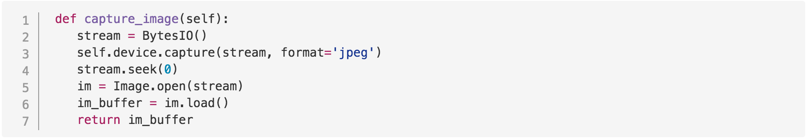
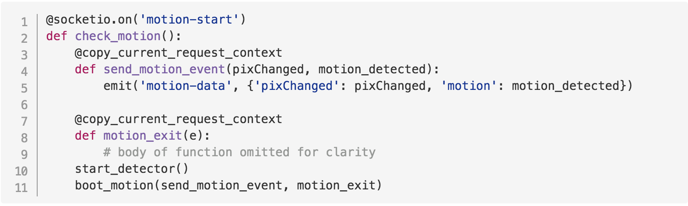
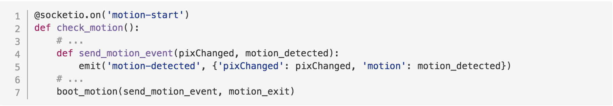
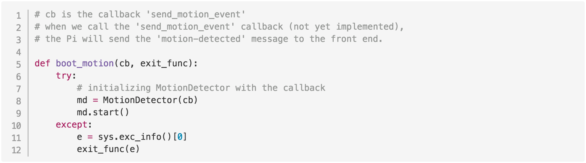
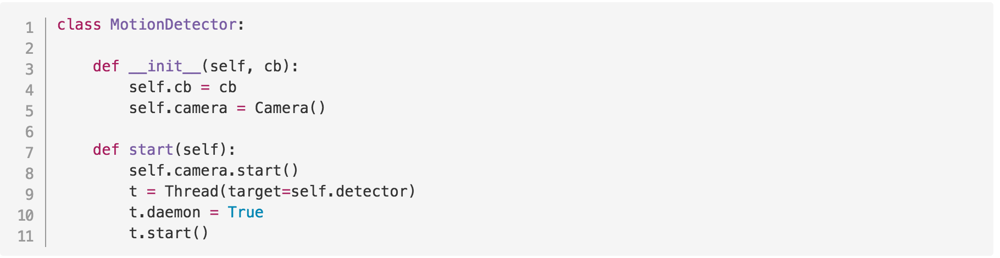
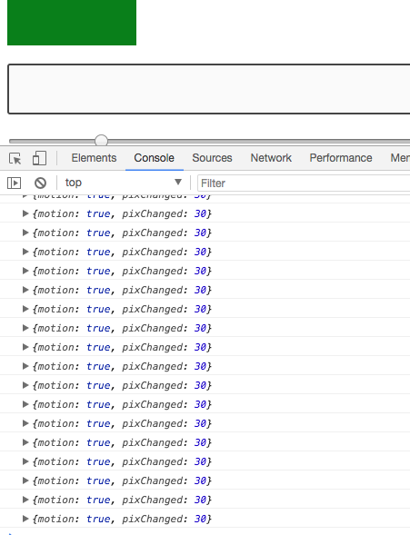
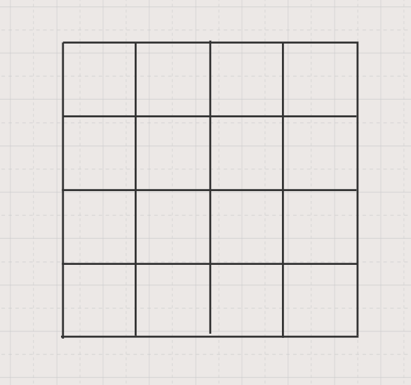

| Table Of Contents                  |
| ---------------------------------- |
| [Introduction](../README.md)       |
| [Part 0: Prework](prework.md)      |
| [Part 1: Pi and Web App](part1.md) |
| Part 2: Motion Detection           |

# Part 2: Motion Detection

## Introduction

In Part 2 of this tutorial, we are going to write code to detect motion using the camera connected to your Pi.
By the end of Part 2, you will have an application that will display whether or not motion was detected in front of the camera.

## Part 2 Steps

- Write some code
- Push code to balena remote
- Rinse, repeat

In this section, we'll be working in the `server` directory, meaning that the code we write in Part 2 will be code that will run on our Pi, not on our front end. The front end code has been written for you, so once you get the Pi code working correctly, you'll have a fully functioning motion-detecting camera application, complete with front end controls for sensitivity!

### 1. Let's dive into the code!

We've set up a few small placeholder methods on this branch to get you started, but the code is not complete.

**In this section, we'll take a quick tour through some of the code that has been written for you.**

### camera.py

Open `camera.py` in your text editor. Inside the file, you'll see a camera class written for you. We're not going to modify this, but we'll make use of it in our motion-detecting code.

Our camera class has `start`, `stop`, and `capture_image` functions.

Let's look quickly at `capture_image`, since that's the one that's going to be most important for our motion-detection functionality. We've copied it below:

**Code Example 1:**
_from PiMotions/server/camera.py_:


`self` is the instance of the camera class.
`self.device` is set to an instance of PiCamera in the `start` method.

```python
    self.device = PiCamera()
```

`picamera` is a library we're imported to give us a python interface to the Raspberry Pi camera module. By setting `self.device = PiCamera()` we now have full-fledged camera functionality on instances of our Camera class. That allows us to call `self.device.capture` to take images.

The other library we need to highlight is PIL, or [Python Imaging Library](http://effbot.org/imagingbook/pil-index.htm), which we need for image processing.

Now that we've introduced the libraries, we can walk through `capture_image`.
At the beginning of the function, we read an image to a BytesIO stream (lines 2 and 3). We move to the start of the stream (line 4), and then load a PIL Image object from the stream in line 5. We then call `load` on the PIL Image object, which reads the image data and returns a pixel access object that we can use to read pixels.

If we wanted to, we could access a specific pixel in the `im_buffer` by providing the pixel coordinates (ex `im_buffer[x,y]`), which will return a tuple (a collection) of RGB values.

```python
  x = 10
  y = 12
  print(image_buffer[x,y])
```

`print(image_buffer[x,y])` could print out something like `(10, 232, 218)`, representing the R, G, and B values respectively of the pixel at that `x,y` location.

In case you were wondering, the color rgb(10, 232, 218) looks like this!


With an understanding of our camera under our belts, let's take a quick tour through our server.py file.

### server.py

Open `server.py` in your text editor.

We're using sockets in this application, meaning that we're using real-time event-based communication between our Pi and our web app. If you don't know what that means, don't worry!

At a high level, you can think about sockets like a line of communication that stays open between the web app and the Pi. The web app and the Pi are listening on this line of communication for different events.

We can see an example of this communication by examining the code excerpted below from `server.py`.

When the web app emits the 'motion-start' event (line 1), the Pi will take certain actions, like calling the function `start_detector()` and `boot_motion()` (lines 10 and 11 in the example below).

When the function `send_motion_event` (line 4) is called, the Pi emits a message of its own back to the web app (line 5), sending a `"motion-data"` message with some data for the web app to display.

**Code Example 2:**
_from PiMotions/server/server.py_:


Now that we know what our camera looks like and how the real-time communication works between the Pi and the web app, let's write some motion-detecting code of our own!

### 2. Motion-detection magic

All of our code is going to be written in motion-detector.py. When we get the code we need written in this file, our front end will magically work!

Open motion-detector.py in your text editor.

#### **A few things to notice before we start writing code:**

##### 1) Firstly, we have values for threshold, sensitivity, and whether or not our motion detector is running at the top of the file.

_from PiMotions/server/motion-detector.py_:

```python
# Threshold is the threshold of difference between color values in two pixels, beyond which we consider the pixels to be significantly different
THRESHOLD = 10

# Sensitivity is the number of pixels required to be "changed" for motion to be detected
SENSITIVITY = 20

# A boolean to control when we run and stop the motion detector loop
RUN_DETECTOR = True
```

##### 2) Secondly, remember `boot_motion(send_motion_event, motion_exit)` from **Code Example 2**?

`boot_motion` is the function we call when our Pi gets a message from the web app to 'motion-start'.

In `boot_motion`, we take "send_motion_event" as one of the arguments (copied below for convenience).

**Code Example 3:**
_from PiMotions/server/server.py_:


In motion_detector.py (excerpted below in **Code Example 4**), we can see that the first argument to `boot_motion` is a callback (cb). We use that callback in the initialization of our `MotionDetector` class (line 8). At some point (not yet implemented), we'll call that callback, which will then cause the Pi to emit the 'motion-data' message to the web app with the data it needs (line 5 above in **Code Example 3**)

**Code Example 4:**
_from PiMotions/server/motion-detector.py_:


In addition to `boot_motion`, we have some other utility functions at the bottom of the motion-detector.py file written for us. We don't need to edit these, but you can take a quick look to see what's there.

##### 3) Finally, inside of the motion detector class, the `start` method has also been written for us.

**Code Example 5:**
_from PiMotions/server/motion-detector.py_:


The `start` method of our `MotionDetector` class is worth examining, because it's what kicks off all of the motion detection functionality. We call `start()` on an instance of `MotionDetector` in the `boot_motion` method (**Code Example 4**, line 9).

In the `start` method, we first start the camera (line 8 in **Code Example 5** above).

The camera is an instance of the Camera class we looked at in **Code Example 1**.

Then, we have these lines:

```python
def start
    # ...
    t = Thread(target=self.detector)
    # ...
    t.start()
```

What's going on here?

`t = Thread(target=self.detector)` is creating a new thread called `t`. Setting the `target` of the thread to `self.detector` means that `self.detector` is the function that will get called when the thread is started (`t.start()`).

> **What's a thread?**
>
> A thread is an ordered sequence of instructions for a computer. When we have more than one thread in a program, we can execute multiple sequences as if they were running at the same time.
> _There's a little more to it, but that's all you need to know for this workshop_.

> **Why are we creating a new thread here?**
>
> Essentially, we want our motion detecting process to be able to run independently of what our server needs to do, and we don't want either process to block the other. This is an easy way for us to do that.

So when `t.start()`, gets called, `self.detector` will get called. `self.detector` isn't yet implemented, but it's the first method we're going to write together in the next section.

> **If you need a quick recap, the steps we've covered so far to start the motion-detecting process look like this:**
>
> 1. A user clicks the "Turn Motion Detection On" button.
> 2. The front end sends the Pi a message to 'motion-start'.
> 3. The Pi calls `start_detector` and `boot_motion`.
> 4. `start_detector` sets our global variable `RUN_DETECTOR` to true.
> 5. `boot_motion` creates a new instance of the `MotionDetector` class, and then calls `start` on that instance.
> 6. The `start` method kicks off a new thread, which calls `self.detector`.

#### Okay, we're ready to write some code!

We're going to implement the `detector`, `check_for_motion`, and `pix_diff` methods in the `MotionDetector` class. Once we do that, we'll have a working motion-detecting application that leverages the Raspberry Pi.

Right now, our `MotionDetector` class looks like this:

```python
class MotionDetector:

    def __init__(self, cb):
        self.cb = cb
        self.camera = Camera()

    def start(self):
        self.camera.start()
        t = Thread(target=self.detector)
        t.daemon = True
        t.start()

    def stop(self):
        self.camera.stop()

    def pix_diff(self, pixel_one, pixel_two):
        pass

    def check_for_motion(self, image_one, image_two):
        pass

    def detector(self):
        pass

```

### The `detector` method

The first method we're going to write is the `detector` method.

`detector` is going to have a loop that runs based on the `RUN_DETECTOR` variable. `RUN_DETECTOR` is either `True` or `False` depending on whether the user turns the motion detector on or off in the front end.

When `RUN_DETECTOR` is true, we want to continuously check for motion. We want to send motion data to the front end. The data will be the number of pixels changed and whether motion was detected.

To start, let's hardcode some values and see how this works.

Change your `detector` method so it looks like this (you can skip the comments ;)):

```python
def detector(self):
    while RUN_DETECTOR:
        pixels_changed = 30
        motion_detected = True
        # remember, self.cb is the send_motion_event method in Code Example 3
        # The line below will 'emit' this data to the front end.
        # The data will look like {'pixChanged': 30, 'motion': true})
        self.cb(pixels_changed, motion_detected)
        time.sleep(1)
    self.stop()
```

Here, we are hardcoding a pixel change value of 30, and we're saying motion_detected is always true. We're doing this inside of an loop with `while RUN_DETECTOR`, so once we deploy this code to the Pi and we press "Turn Motion Detector On", the Pi should consistently send `{'pixChanged': 30, 'motion': true}` to the front end every second. `time.sleep(1)` makes the loop wait a second before emitting the next event.

Now, let's push our code to our Pi using the balena git remote we added in Part 1 of the workshop. To do this type the following into the command line.

```
git push balena master
```

This sync may take a few minutes, but you can can watch the progress in your balena.io device dashboard.

Once the sync completes, go to the web app at `localhost:80` in your browser.

Click the button to "Turn Motion Detector On". You can watch the data come in from the Pi by opening your browser's developer console. (In Chrome, you can open the console by going to the Chrome menu in the top right of your browser window (the three dots) > More Tools > Developer Tools).

You should see a green box appear on the screen. The green means we've detected motion, and the size of the box represents the number of pixels changed (at this point, 30).



Now, let's make the loop actually do what we want it to do.

Our goal for the `detector` method is for it to take two images and check the images against each other. If the images are significantly different, we know we've detected motion. Every loop, we want to send the comparison data to the front end, so that the front end can display a consistent stream of information to the user about whether or not motion was detected.

Change your `detector` method so it looks like this:

```python
def detector(self):
    # take first image
    image_one = self.camera.capture_image()

    while RUN_DETECTOR:
        # take second image
        image_two = self.camera.capture_image()

        # compare the two images with a method we haven't implemented yet
        # (check_for_motion), and return two values
        pixels_changed, motion_detected = self.check_for_motion(image_one, image_two)

        # set the image_one variable to the second image to
        # get ready for the next loop
        image_one = image_two

        # notify the front end
        self.cb(pixels_changed, motion_detected)
    self.stop()
```

This is what our final `detector` code will be. Now, let's implement `check_for_motion`, since we use it in `detector` but we haven't implemented it yet.

### The `check_for_motion` method

Based on our code in `detector` (copied below), We know `check_for_motion` needs to return two values, and it needs to take two images as arguments.

```python
pixels_changed, motion_detected = self.check_for_motion(image_one, image_two)
```

The objective for `check_for_motion` will be to have it compare the two images, and then return two values for the number of pixels changed and whether or not motion was detected.

To wire things up, let's again use some fake data.

Change `check_for_motion` so it looks like this:

```python
def check_for_motion(self, image_one, image_two):
    pixels_changed = 30
    motion_detected = True
    return pixels_changed, motion_detected
```

Then, push up your code to balena again:

```
git push balena master
```

Once the sync is complete, we can go back to the browser at `localhost:80` (you may need to do a hard refresh). We should see the same behavior as we saw last time, because we are using the same fake values.

Right now, our code should look like this:

```python
class MotionDetector:

    def __init__(self, cb):
        self.cb = cb
        self.camera = Camera()

    def start(self):
        self.camera.start()
        t = Thread(target=self.detector)
        t.daemon = True
        t.start()

    def stop(self):
        self.camera.stop()

    def pix_diff(self, pixel_one, pixel_two):
        pass

    def check_for_motion(self, image_one, image_two):
      pixels_changed = 30
      motion_detected = True
      return pixels_changed, motion_detected

   def detector(self):
      image_one = self.camera.capture_image()
      while RUN_DETECTOR:
          image_two = self.camera.capture_image()
          pixels_changed, motion_detected = self.check_for_motion(image_one, image_two)
          image_one = image_two
          self.cb(pixels_changed, motion_detected)
      self.stop()
```

Alright, let's actually implement `check_for_motion`. This is a pretty interesting method, and it's going to do a lot of the heavy lifting for us.

Change your `check_for_motion` method so it looks like the following:

```python
def check_for_motion(self, image_one, image_two):
    motion_detected = False
    changed_pixels = []

    for x in range(0, self.camera.width):
        for y in range(0, self.camera.height):
            pixel_one = image_one[x,y]
            pixel_two = image_two[x,y]

            pixel_changed = self.pix_diff(pixel_one, pixel_two)
            changed_pixels.append(pixel_changed)

    total_changed_pixels = sum(changed_pixels)

    if total_changed_pixels > SENSITIVITY:
        return total_changed_pixels, True
    else:
        return total_changed_pixels, False
```

So what's happening here?

Back up in the section where we discussed the code in the camera.py file, we talked about how our image is loaded so that it returns a pixel access object.

So `image_one` and `image_two` in the method are just collections of pixels (no surprise there), and each pixel has RGB values.

That means we can access a specific pixel in an image by providing x and y coordinates.

Imagine that we had a picture that was 4 pixels wide and 4 pixels tall. It would look like this:



To access the pixel in the first row, first column, we could write

```python
x_coord = 0
y_coord = 0
pic[x_coord, y_coord] # pic[0,0]
```

In our `change_motion` method, we're examining the pictures pixel-by-pixel by using two nested loops.

We start by looking at the pixel at [0,0] for image_one and compare that to the pixel in the same location in image_two.

We compare the pixels using the `pix_diff` method (not yet implemented).

The `pix_diff` method will return either `True` or `False`. If the pixels at [0,0] for image_one and image_two are significantly different, `pix_diff` will return `True`. If the pixels are not significantly different, we will return `False`.

We append that value to the `changed_pixels` array, which at the end of our loops, will be an array of `True` and `False` values for each of the pixel locations in image_one and image_two.

```python
# eventually, our changed_pixels array will look like this
changed_pixels = [True, False, True, True, False ...]
```

We proceed through the nested loops, comparing each of the pixels in image_one to the pixels in the same location in image_two.

```python
# excerpt of method
    # ...
    # x val is the row, y val is the column
    for x in range(0, self.camera.width):
        for y in range(0, self.camera.height):
            # Check the same pixel location in each image
            pixel_one = image_one[x,y]
            pixel_two = image_two[x,y]

            # Check the difference between each pixel (returns T or F)
            pixel_changed = self.pix_diff(pixel_one, pixel_two)

            changed_pixels.append(pixel_changed)
            # ...
```

When we have traversed all of the pixels in image_one and image_two row-by-row, we will have a big array of `True` and `False` values stored in the `changed_pixels` array.

We then will count all of the `True` values in the `changed_pixels` array with the following line:

```python
total_changed_pixels = sum(changed_pixels)
```

If the count of `True` values (which is the total number of significantly different pixels in our two images) exceeds our `SENSITIVITY`, `check_for_motion` will return `True`. Otherwise, it will return `False`.

> Note: The `SENSITIVITY` value is set at the top of this file, and can be updated by the user on the front end.

```python
if total_changed_pixels > SENSITIVITY:
    return total_changed_pixels, True
else:
    return total_changed_pixels, False
```

Whew! That was a lot. One more method to implement, and we'll be done!

### The `pix_diff` method

Our final step is to build the `pix_diff` method, which is going to compare the values in pixels in the same location from each of the photos.

`pix_diff` takes a pixel from image_one and a pixel from image_two, and then compares the green values between them.

We use the green values (the G in RGB), because the green value is the most sensitive to change. We'll be able to detect motion just by comparing the difference in green values between pixels in the two images.

The implementation of `pix_diff` looks like this:

```python
def pix_diff(self, pixel_one, pixel_two):
    green_val_one = pixel_one[1]
    green_val_two = pixel_two[1]

    green_change = abs(green_val_one - green_val_two)

    if green_change > THRESHOLD:
        return True
    else:
        return False
```

When we pass pixel_one and pixel_two to the `pix_diff` method, they are each collections of RGB values. `(R, G, B)`

Remember our friend `(10, 232, 218)` from the camera.py section?


Let's assign that to a variable called `pixel`.

```python
 # index: 0   1    2
 # color: R   G    B
pixel = (10, 232, 218)
```

To access the green value of `pixel`, we can call `pixel[1]`. The collection of values is 0-indexed, meaning that to get the first value, we'd use `pixel[0]`. To get the second value (the green value, the one we want), we use `pixel[1]`.

```python
# access the green value of pixel
pixel[1] = 232
```

In the `pix_diff` method, we compare the green values of pixel_one and pixel_two. We use the absolute value function from python to make sure we always have a positive number.

If the absolute value of the difference in green values is greater than our `THRESHOLD` value, then we return true, meaning we have determined that the two pixels are significantly different. Otherwise, we return false.

> Note: The `THRESHOLD` value is set at the top of this file, and can be updated by the user on the front end.

```python
  if green_change > THRESHOLD:
      return True
  else:
      return False
```

With `pix_diff` completed, we should be done!

Our final code for `MotionDetector` should now look like this:

```python
class MotionDetector:

    def __init__(self, cb):
        self.cb = cb
        self.camera = Camera()

    def start(self):
        self.camera.start()
        t = Thread(target=self.detector)
        t.daemon = True
        t.start()

    def stop(self):
        self.camera.stop()

    def pix_diff(self, pixel_one, pixel_two):
        green_val_one = pixel_one[1]
        green_val_two = pixel_two[1]
        green_change = abs(green_val_one - green_val_two)
        if green_change > THRESHOLD:
            return True
        else:
            return False

    def check_for_motion(self, image_one, image_two):
        motion_detected = False
        changed_pixels = []

        for x in range(0, self.camera.width):
            for y in range(0, self.camera.height):
                pixel_one = image_one[x,y]
                pixel_two = image_two[x,y]
                pixel_changed = self.pix_diff(pixel_one, pixel_two)
                changed_pixels.append(pixel_changed)

        total_changed_pixels = sum(changed_pixels)
        if total_changed_pixels > SENSITIVITY:
            return total_changed_pixels, True
        else:
            return total_changed_pixels, False

    def detector(self):
        image_one = self.camera.capture_image()
        while RUN_DETECTOR:
            image_two = self.camera.capture_image()
            pixels_changed, motion_detected = self.check_for_motion(image_one, image_two)
            image_one = image_two
            self.cb(pixels_changed, motion_detected)
        self.stop()
```

Do a final push to the balen remote to get our code changes deployed to the Pi:

```
git push balena master
```

## Once that last sync completes, you're done! :tada:

Congratulations! You now have a fully-functioning motion-detecting application that uses the camera on a Raspberry Pi to take the pictures, and a web front end for user controls.

### Seeing the results of your work

Go look at the web app at `localhost:80` in your browser.
Make sure you have clicked "Turn Motion Detector On".

Wave your hand in front of camera on the Pi. You should see the green bar jump in size. If you open developer tools, you should see data being continuously sent from the Pi to the front end.

Try experimenting with adjusting the sensitivity levels and the threshold levels to see how that affects the behavior.

:tada::tada::tada::tada:

> Quick Note: For your reference, the completed code is on a branch called `motion-detection-complete`.
> You can checkout that branch by running `git checkout motion-detection-complete` in your terminal.

### 3. What do I do now?

If you get to the end of this workshop and still want more, there are plenty of things you can do to extend the application.

**Here's a few ideas, but the possibilities are pretty endless.**

1. Edit the front end if you like design.
2. Modify the motion-detecting algorithm to detect motion differently. (Other methods might compare entropy in the images, or leverage 3rd party libraries).
3. Add additional features, like using a 3rd-party service like Twilio to text you when your camera senses motion!
4. Experiment with the other capabilities of the Pi camera module, like taking video!
