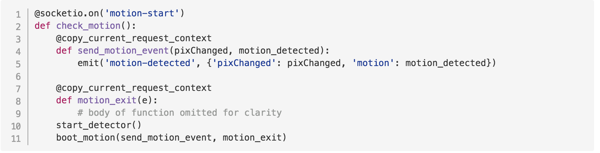
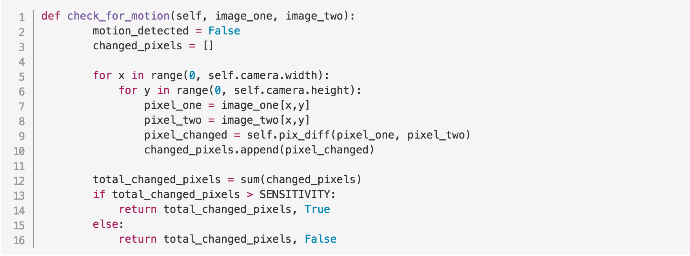

| Table Of Contents                   |
| ------------------------------------|
| [Introduction](../README.md)           |
| [Part 0: Prework](prework.md)       |
| [Part 1: Pi and Web App](part1.md)  |
| Part 2: Motion Detection            |

# Part 2: Motion Detection
## Introduction

In Part 2 of this tutorial, you are going to write code to detect motion using the camera connected to your Pi.
By the end of Part 2, you will have an application that will display whether or not motion was detected in front of the camera.

## Part 2 Steps
- Write some code
- Resin sync
- Rinse, repeat

We'll mainly be working in the `server` directory, meaning that the code we write in Part 2 will be code that will run on our Pi, not on our front end. The front end code has been written for you, so once you get the Pi code working correctly, you'll have a fully functioning motion-detecting camera application, complete with front end controls for sensitivity!

### 1. Let's dive into the code!

So now we are going to push this code to the Pi.
in order to do that, we need resin cli.

npm install --global --production resin-cli


We've set up a few small placeholder methods on this branch to get your started, but the code is not complete.

**In this section, we'll take a quick tour through some of the code that has been written for you.**

### camera.py

Open `camera.py` in your text editor. Inside the file, you'll see a camera class written for you. We're not going to modify this, but we'll make use of it in our motion-detecting code.

Our camera class has `start`, `stop`, and `capture_image` functions.

Let's look quickly at `capture_image`, since that's the one that's going to be most important for our motion-detection functionality. We've copied it below:

**Code Example 1:**
_from PiMotions/server/camera.py_:


`self` is the instance of the camera class.
`self.device` is set to an instance of PiCamera in the `start` method.
```python
    self.device = PiCamera()
```
 `picamera` is a library we're imported to give us a python interface to the Raspberry Pi camera module. By setting `self.device = PiCamera()` we now have full-fledged camera functionality on instances of our Camera class. That allows us to call `self.device.capture` to take images.

The other library we need to highlight is PIL, or [Python Imaging Library](http://effbot.org/imagingbook/pil-index.htm), which we need for image processing.

Now that we've introduced the libraries, we can walk through `capture_image`.
At the beginning of the function, we read an image to a BytesIO stream (lines 2 and 3). We move to the start of the stream (line 4), and then load a PIL Image object from the stream in line 5. We then call `load` on the PIL Image object, which reads the image data and returns a pixel access object that we can use to read pixels.

If we wanted to, we could access a specific pixel in the `im_buffer` by providing the pixel coordinates (ex `im_buffer[x,y]`), which will return a tuple (a collection) of RGB values.

```python
  x = 10
  y = 12
  print(image_buffer[x,y])
```
could return something like ```(10, 232, 218)```, representing the R, G, and B values respectively of the pixel at that `x,y` location.

In case you were wondering, the color rgb(10, 232, 218) looks like this!


With an understanding of our camera under our belts, let's take a quick tour through our server.py file.

### server.py

Open `server.py` in your text editor.

We're using sockets in this application, meaning that we're using real-time event-based communication between our Pi and our web app. If you don't know what that means, don't worry!

At a high level, you can think about sockets like a line of communication that stays open between the web app and the Pi. The web app and the Pi are listening on this line of communication for different events.

We can see an example of this communication by examining the code  excerpted below from `server.py`.

When the web app emits the 'motion-start' event (line 1), the Pi will take certain actions, like calling the function `start_detector()` and `boot_motion()` (lines 10 and 11 in the example below).

When the function `send_motion_event` (line 4) is called, the Pi emits a message of its own back to the web app (line 5), sending a ```"motion-data"``` message with some data for the web app to display.

**Code Example 2:**
_from PiMotions/server/server.py_:


Now that we know what our camera looks like and how the real-time communication works between the Pi and the web app, let's write some motion-detecting code of our own!

### 2. Motion-detection magic

All of our code is going to be written in motion-detector.py. When we get the code we need written in this file, our front end will magically work!

Open motion-detector.py in your text editor.

#### **A few things to notice before we start writing code:**
##### 1) We have values for threshold, sensitivity, and whether or not our motion detector is running at the top of the file.

_from PiMotions/server/motion-detector.py_:
```python
# Threshold is the threshold of change in the color value of a pixel
THRESHOLD = 10

# Sensitivity is the required number of pixels that are "changed" for motion to be detected
SENSITIVITY = 20

# A boolean to control when we run and stop the motion detector loop
RUN_DETECTOR = True
```

##### 2) Remember ```boot_motion(send_motion_event, motion_exit)``` from line 11, **Code Example 2**? ```boot_motion``` is the function we call when our Pi gets a message from the web app to 'motion-start'.

In `boot_motion`, we take the "send_motion_event" as one of the arguments (**Code Example 2**, line 4, and also copied below).

**Code Example 3:**
_from PiMotions/server/server.py_:


In motion_detector.py (excerpted below in **Code Example 4**), we can see that the first argument to `boot_motion` is a callback (cb). We use that callback in the initialization of our `MotionDetector` class (line 8). At some point (not yet implemented), we'll call that callback, which will then cause the Pi to emit the 'motion-data' message to the web app with the data it needs (line 5 above in **Code Example 3**)

**Code Example 4:**
_from PiMotions/server/motion-detector.py_:


In addition to ```boot_motion```, we have some other utility functions at the bottom of the motion-detector.py file written for us. We don't need to edit these, but you can take a quick look to see what's there.

##### 3) Inside of the motion detector class, the ```start``` method has also been written for us.

**Code Example 5:**
_from PiMotions/server/motion-detector.py_:


The `start` method of our `MotionDetector` class is worth examining, because it's what kicks off all of the motion detection functionality. We call `start()` on an instance of `MotionDetector` in the `boot_motion` method (**Code Example 4**, line 9).

In the `start` method, we first start the camera (line 8), which is the instance of the camera class we looked at in **Code Example 1**. Then, we have these lines:

```python
    t = Thread(target=self.detector)
    # ... omitted for clarity
    t.start()
```
What are we doing here?

`t = Thread(target=self.detector)` is creating a new thread called `t`. Setting the `target` of the thread to `self.detector` means that `self.detector` is the function that will get called when the thread is started (`t.start()`).

> **What's a thread?**
> A thread is an ordered sequence of instructions for a computer. When we have more than one thread in a program, we can execute multiple sequences as if they were running at the same time.
_There's a little more to it, but that's all you need to know for this workshop_.

> **Why are we creating a new thread here?**
> Essentially, we want our motion detecting process to be able to run independently of what our server needs to do, and we don't want either process to block the other. This is an easy way for us to do that.

So when `t.start()`, gets called, `self.detector` will get called. `self.detector` isn't yet implemented, but it's the first method we're going to write together in the next section.

> **If you need a quick recap, the steps we've covered so far to start the motion-detecting process look like this:**
> 1) Front end tells the Pi to 'motion-start' because a user clicked the "Turn Motion Detection On" button.
> 2) The Pi calls `start_detector` and `boot_motion` methods.
> 3) `start_detector` sets our global variable `RUN_DETECTOR` to true.
> 4) `boot_motion` creates a new instance of the `MotionDetector` class, and then calls `start` on that instance.
> 5) The `start` method kicks off a new Thread, which calls `self.detector`.


#### Okay, we're ready to write some code!

We're going to implement the `detector`, `check_for_motion`, and `pix_diff` methods in the `MotionDetector` class. Once we do that, we'll have a working motion-detecting application that leverages the Raspberry Pi.

Right now, our `MotionDetector` class looks like this:

```python
class MotionDetector:

    def __init__(self, cb):
        self.cb = cb
        self.camera = Camera()

    def start(self):
        self.camera.start()
        t = Thread(target=self.detector)
        t.daemon = True
        t.start()

    def stop(self):
        self.camera.stop()

    def pix_diff(self, pixel_one, pixel_two):
        pass

    def check_for_motion(self, image_one, image_two):
        pass

    def detector(self):
        pass

```

### The `detector` method
The first method we're going to write is the `detector` method.

`detector` is going to have a loop that runs based on the `RUN_DETECTOR` variable. `RUN_DETECTOR` is either `False` or `True` depending on whether the user turns the motion detector on or off in the front end.

When `RUN_DETECTOR` is true, we want to continuously check for motion. We want to send motion data value to the front end. The data will be the number of pixels changed, and whether motion was detected.

To start, let's hardcode some values and see how this works.

Change your `detector` method so it looks like this (you can skip the comments ;)):

```python
def detector(self):
    while RUN_DETECTOR:
        pixels_changed = 30
        motion_detected = True
        # remember, self.cb is the send_motion_event method in Code Example 3
        # The line below will 'emit' this data to the front end.
        # The data will look like {'pixChanged': 30, 'motion': true})
        self.cb(pixels_changed, motion_detected)
        time.sleep(1)
    self.stop()
```
Here, we are hardcoding a pixel change value of 30, and we're saying motion_detected is always true. We're doing this inside of an loop with `while RUN_DETECTOR`, so once we deploy this code to the Pi and we press "Turn Motion Detector On", the Pi should consistently send `{'pixChanged': 30, 'motion': true}` to the front end every second. `time.sleep(1)` makes the loop wait a second before sending emitting the next event.

Now, let's push our code to our Pi using the resin cli. To do this, copy and paste this command into your terminal.
```python
resin sync --source ./server --destination /server
```
This sync may take a few minutes, but you can can watch the progress in your resin.io device dashboard.

Once sync completes, go to web app at `localhost:80` in your browser.
Click the button to "Turn Motion Detector On". You should see events start to come in. You can watch the events in your developer console. (In Chrome, you can open the console by going to the Chrome menu in the top right of your browser window (the three dots) > More Tools > Developer Tools).

You should see a green box appear on the screen. The green means we've detected motion, and the size represents the number of pixels changed (at this point, 30).


Now, let's make the loop actually do what we want it to do.

Our goal for the `detector` method is that we want it to take two images and check the images against each other. If the images are significantly different, we know we've detected motion. Every loop, we want to send the comparison data to the front end, so that the front end can display a consistent stream of information to the user about whether or not motion was detected.

Change your `detector` method so it looks like this:

```python
def detector(self):
    # take first image
    image_one = self.camera.capture_image()

    while RUN_DETECTOR:
        # take second image
        image_two = self.camera.capture_image()

        # compare the two images with a method we haven't implemented yet
        # (check_for_motion), and return two values
        pixels_changed, motion_detected = self.check_for_motion(image_one, image_two)

        # set the image_one variable to the second image to
        # get ready for the next loop
        image_one = image_two

        # notify the front end
        self.cb(pixels_changed, motion_detected)
    self.stop()
```
This is what our final `detector` code will be. Now, let's implement `check_for_motion`, since we use it in `detector` but we haven't implemented it yet.

### The `check_for_motion` method

Based on our code in `detector` (copied below), We know `check_for_motion` needs to return two values, and it needs to take two images as arguments.

```python
pixels_changed, motion_detected = self.check_for_motion(image_one, image_two)
```
The objective for `check_for_motion` will be to have it compare the two images, and then return two values for the number of pixels changed, and whether or not motion was detected.

To wire things up, let's again use some fake data.

Change `check_for_motion` so it looks like this:

```python
def check_for_motion(self, image_one, image_two):
    pixels_changed = 30
    motion_detected = True
    return pixels_changed, motion_detected
```
Then, run your resin sync command in the terminal again:
```python
resin sync --source ./server --destination /server
```
Once the sync is complete, we can go back to the browser at `localhost:80` (you may need to do a hard refresh). We should see the same behavior as we saw last time, because we are using the same fake values.

So right now our code should look like this:
```python
class MotionDetector:

    def __init__(self, cb):
        self.cb = cb
        self.camera = Camera()

    def start(self):
        self.camera.start()
        t = Thread(target=self.detector)
        t.daemon = True
        t.start()

    def stop(self):
        self.camera.stop()

    def pix_diff(self, pixel_one, pixel_two):
        pass

    def check_for_motion(self, image_one, image_two):
      pixels_changed = 30
      motion_detected = True
      return pixels_changed, motion_detected

   def detector(self):
      image_one = self.camera.capture_image()
      while RUN_DETECTOR:
          image_two = self.camera.capture_image()
          pixels_changed, motion_detected = self.check_for_motion(image_one, image_two)
          image_one = image_two
          self.cb(pixels_changed, motion_detected)
      self.stop()
```

Alright, let's actually implement `check_for_motion`. This is a pretty interesting method, and it's going to do a lot of the heavy lifting for us.

Change your `check_for_motion` method so it looks like the following:



So what's happening here?

... #TODO [check for motion description] ... end #TODO

### The `pix_diff` method

Our final step is to build the `pix_diff` method, which is going to compare the green values in the corresponding pixels from each of the photos.

We use the green values (the G in RGB), because the green value is the most sensitive to change. We'll be able to detect motion just by comparing the difference in green values between pixels in the two images.

```python
def pix_diff(self, pixel_one, pixel_two):
        green_val_one = pixel_one[1]
        green_val_two = pixel_two[1]

        green_change = abs(green_val_one - green_val_two)

        if green_change > THRESHOLD:
            return True
        else:
            return False
```

... #TODO pix_diff explanation

Green is 1 index of collection.
green_val = img_pix[1]

want abs value of diff between two so it's always pos
green change = abs value (green val 1 - green val 2)
if it's over sensitivity, we say true. if not, false.
... end #TODO

With `pix_diff` completed, we should be done!

Do a final resin sync to get our code changes deployed to the Pi:
```python
resin sync --source ./server --destination /server
```

### The final code

The final code for `MotionDetector` should look like the following:
```python
class MotionDetector:

    def __init__(self, cb):
        self.cb = cb
        self.camera = Camera()

    def start(self):
        self.camera.start()
        t = Thread(target=self.detector)
        t.daemon = True
        t.start()

    def stop(self):
        self.camera.stop()

    def pix_diff(self, pixel_one, pixel_two):
        green_val_one = pixel_one[1]
        green_val_two = pixel_two[1]
        green_change = abs(green_val_one - green_val_two)
        if green_change > THRESHOLD:
            return True
        else:
            return False

    def check_for_motion(self, image_one, image_two):
        motion_detected = False
        changed_pixels = []

        for x in range(0, self.camera.width):
            for y in range(0, self.camera.height):
                pixel_one = image_one[x,y]
                pixel_two = image_two[x,y]
                pixel_changed = self.pix_diff(pixel_one, pixel_two)
                changed_pixels.append(pixel_changed)

        total_changed_pixels = sum(changed_pixels)
        if total_changed_pixels > SENSITIVITY:
            return total_changed_pixels, True
        else:
            return total_changed_pixels, False

    def detector(self):
        image_one = self.camera.capture_image()
        while RUN_DETECTOR:
            image_two = self.camera.capture_image()
            pixels_changed, motion_detected = self.check_for_motion(image_one, image_two)
            image_one = image_two
            self.cb(pixels_changed, motion_detected)
        self.stop()
```

Now, go look at the web app at `localhost:80` in your browser.
Make sure you have clicked "Turn Motion Detector On".

Wave your hand in front of camera on the Pi. You should see the green bar jump in size. If you open developer tools, you should see data being continuously sent from the Pi to the front end.

Try experimenting with adjusting the sensitivity levels and the threshold levels to see how that affects the behavior.

## With that last sync, you're done! :tada:

Congratulations! You now have a fully-functioning motion-detecting application that uses the camera on a Raspberry Pi to take the pictures, and a web front end for user controls.

Try experimenting with adjusting the sensitivity levels and the threshold levels.

>Quick Note: The completed code is on a branch called `motion-detection-complete`.
You can checkout that branch by running `git checkout motion-detection-complete` in your terminal.

### 3. What do I do now?

If you get to the end of this workshop and still want more, there are plenty of things you can do to extend the application.

**Here's a few ideas, but the possibilities are pretty endless.**
1. Edit the front end if you like design.
2. Modify the motion-detecting algorithm to detect motion differently. (Other methods might compare entropy in the images, or leverage 3rd party libraries).
3. Add additional features, like using a 3rd-party service like Twilio to text you when your camera senses motion!
4. Experiment with the other capabilities of the Pi camera module, like taking video!
